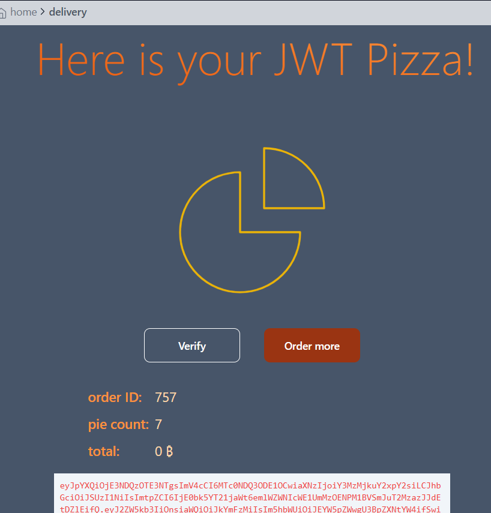
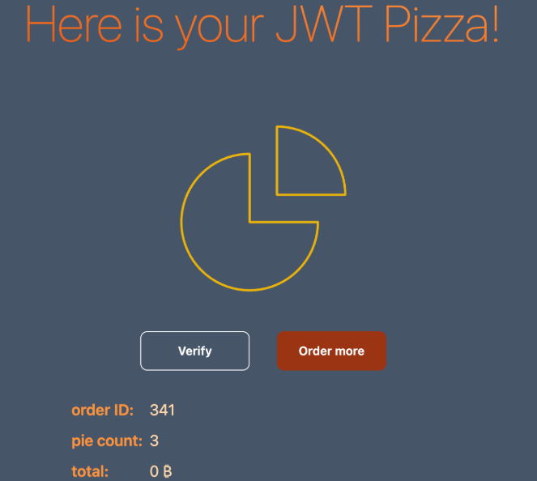
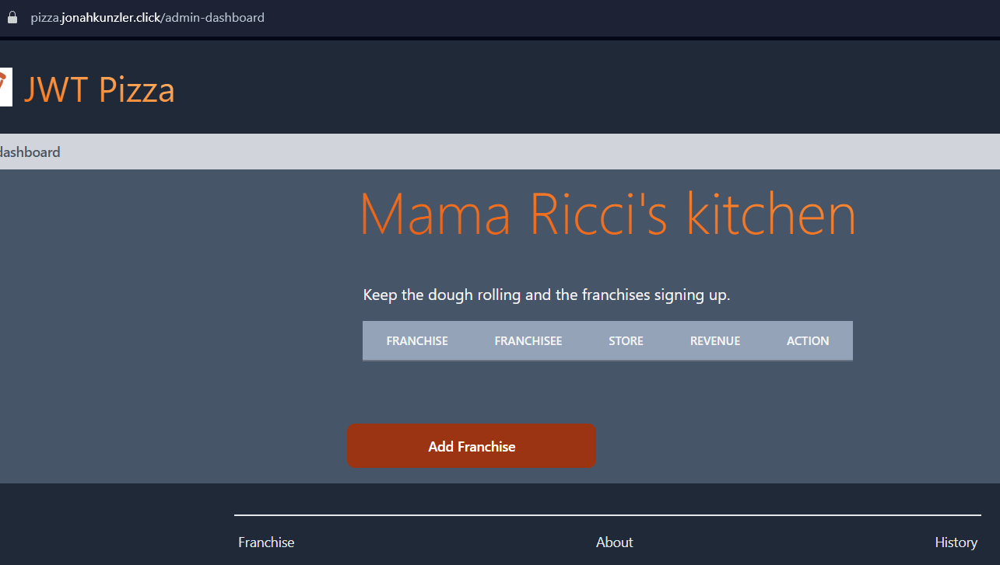
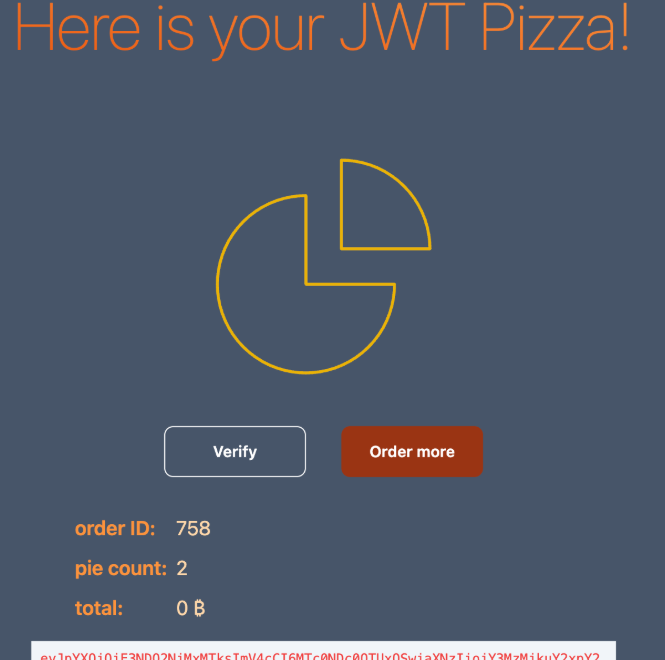

## Daniel Spiesman and Jonah Kunzler

### Self Attacks
#### Daniel
Date: April 11, 2025

Target: pizza.radmuffin.click

Classification: insecure design

Severity: 3

Description: price adjusted before the order request was sent, got 7 free pizzas

Correction: Get prices from the database on the backend when fulfilling orders

#### Jonah
Date: April 14, 2025

Target: pizza.jonahkunzler.click

Classification: Insecure Design

Severity: 3

Description: The pizza ordering system on pizza.jonahkunzler.click suffers from a critical business logic flaw that allows users to place orders without completing payment.

Correction: verify price and payment on the backend so it can't be meddled with

### Peer Attacks
#### Daniel
Date: April 14, 2025

Target: pizza.jonahkunzler.click

Classification: Security misconfiguration

Severity: 2

Description: the admin account had a guessable password I was able to get in and delete all the franchises and stores

Correction: use more secure passwords, maybe multi-factor authentication

### Jonah
Date: April 14, 2025

Target: pizza.radmuffin.click

Classification: Insecure Design

Severity: 3

Description: The pizza ordering system on pizza.radmuffin.click has a moderate flaw: users can order pizzas without paying for them.

Correction: verify price and payment on the backend

### Combined Learning
We learned neither of us are very good at security or penetration. Daniel tried to figure out a SQL injection but it didn't work. He did parameterize the sql queries on his backend. We both ended up doing very simple attacks on each other. It's naive to think you're going to get only expected requests for orders or other use. Have to prepare for It was interesting to go through our websites with that mindset and it would be really cool to learn more about security in the future.